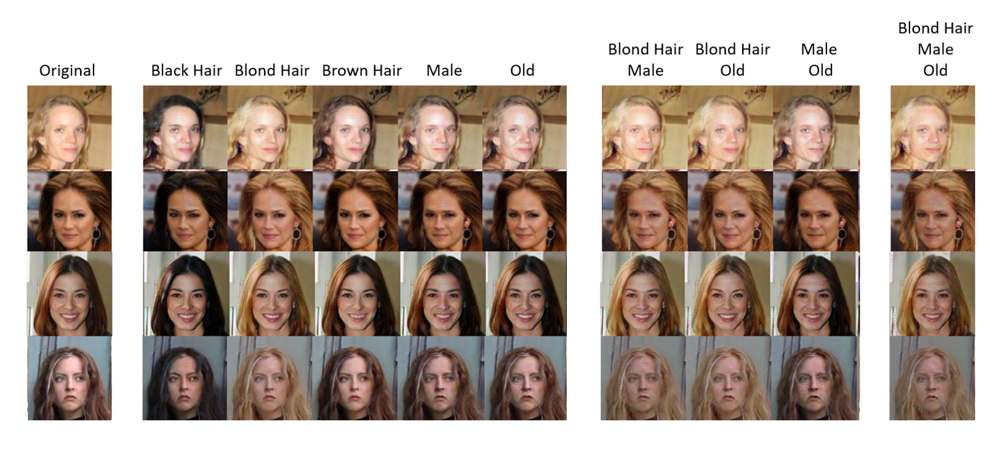
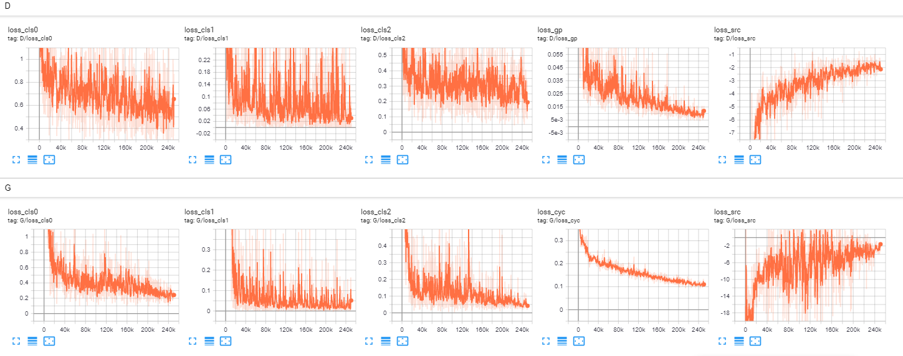
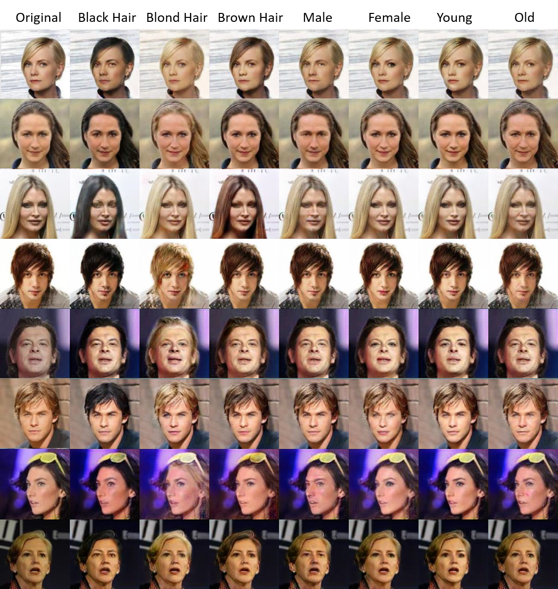
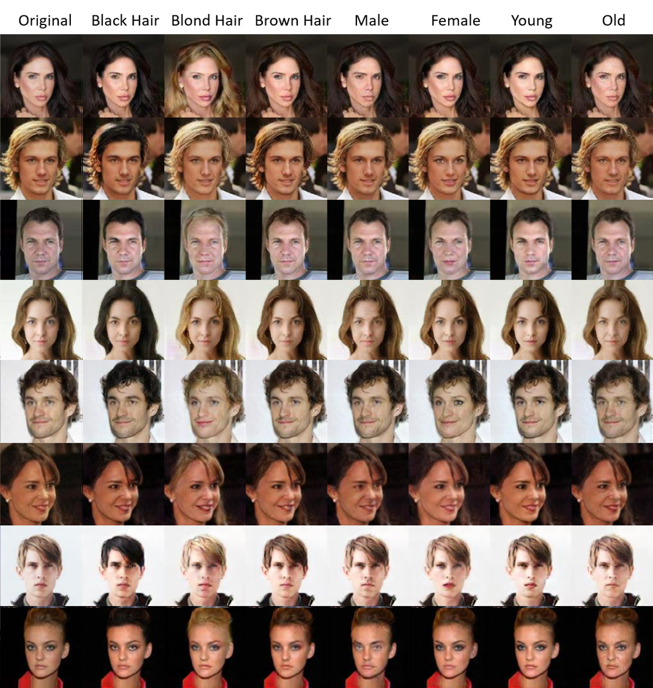

# ModularGAN

<p align="center"></p>

### Introduction
This repository provides an unofficial PyTorch implementation of ModularGan. The original paper is [Modular Generative Adversarial Networks](https://arxiv.org/pdf/1804.03343.pdf).

ModularGAN consists of several reusable and composable modules that carry on different functions (e.g., encoding, decoding, transformations). These modules can be trained simultaneously, leveraging data from all domains, and then combined to construct specific GAN networks at test time, according to the specific image translation task.

**Attention:** **The code is an unofficial version, and the details of model are not exactly same as paper. Especially, the model architecture and hyperparameters are different.**

<br />

### Dependencies
* [Python 3.6+](https://www.continuum.io/downloads)
* [PyTorch 1.0.1+](http://pytorch.org/)
* [tqdm 4.31+](https://tqdm.github.io/)
* [TensorFlow 1.13+](https://www.tensorflow.org/) (optional for tensorboard)

<br />

### Download

#### 1. Repository
```bash
$ git clone https://github.com/LucasBoTang/ModularGAN.git
```

#### 2. Dataset
To download the [CelebA dataset](http://mmlab.ie.cuhk.edu.hk/projects/CelebA.html):
```bash
$ cd ModularGAN/
$ bash download.sh data
```
Or the zip file could be downloaded directly [here](https://www.dropbox.com/s/d1kjpkqklf0uw77/celeba.zip?dl=0).

#### 3. Pretrained model
To download the pretrained model:
```bash
$ cd ModularGAN/
$ bash download.sh model
```
Or the zip file could be downloaded directly [here](https://www.dropbox.com/s/n1vxfdlbrbt4gk4/pretrained.zip?dl=0).

<br />

### Training and testing

#### 1. Training
To train the model
```bash
$ cd ModularGAN/
$ python main.py --mode train --batch_size 16 --num_epochs 20
```

#### 2. Loss curve
<p align="center"></p>

#### 3. Images generation
<p align="center"></p>

#### 4. Testing
To test the model
```bash
$ cd ModularGAN/
$ python main.py --mode test --test_epoch 20
```

#### 5. Cofiguration
Cofiguration (e.g. batch size, number of residual blocks) could be customized easily by using argparse.

<br />

### Result
#### 1. Sample images
<p align="center"></p>
<p align="center"></p>

<br />

### Acknowledgement
The code is mainly based on the GitHub repository [StarGan](https://github.com/yunjey/stargan).
